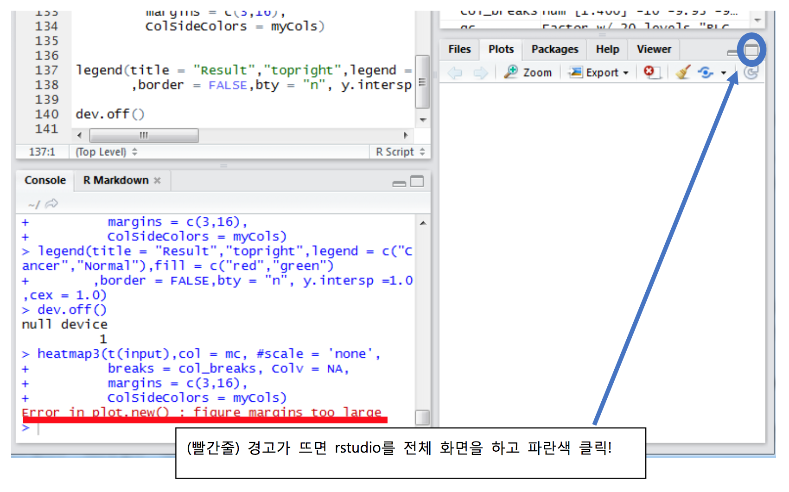

# Heatmap 
- 작성사 : 김성민

## Heatmap3 사용법

## library
```
library(heatmap3) 
library(RColorBrewer) 
library(gplots)
```

## Read Data
```
od<-read.csv("D:/git/SungminCode/HGU/BioData/HowTo/heatmap/sample.csv",header = T,sep = ',') 
dim(od)
```

## Data Processing
```
data<-od
rownames(data)<-data$patient 
#data 의 row names을 data의 patient이름으로 data<-subset(data,select = -c(patient,index)) 
#heatmap3에는 index와 patient이름이 필요가 없다.
```

## Basic 
heatmap에 들어가는 data는 다 numeric data로 되어야 함.
그래서 cancer_code를 지우고, result를 gene interaction을 보는 heatmap 에는 필요가 없다. 
나중에 복잡한 heatmap 그릴때 필요!

```
input<-subset(data,select = -c(cancer_code,result)) 
input <-as.matrix(input)
```
처음에는 일단 기본적인 heatmap을 그린다.

png("파일이름",파일 크기)
--figure--
dev.off() 이것을 해야 plot이 close되고 파일을 최종 저장한다. plot을 저장할때 항상 필요 #그리고 plot을 다시 그릴대 dev.off를 하면 plot 창에 그림이 다 지워진다.

이렇게 안해도 rstudio 옆에 plot에 보여주긴 한다.
예) 그냥 pnt() dev.off()를 빼고 heatmap3(input)만 run! 하면 오른쪽아래 plot크기만 크게 하면 될 것 보일 것이다.
하지만 가끔 오류가 뜨게 되면, 
이 방법을 통해 확인 가능
일단 주석처리 하고 질문이 있으면.. 저에게..


```
#png("basic_heatmap3.png")
#main은 plot 이름을, cexRow = ROW 글자 크기, cexCol = COL 글자 크기. 변경해보면서 확인!
heatmap3(input,main = "test",cexRow = 0.5, cexCol = 0.5) dev.off()
```




